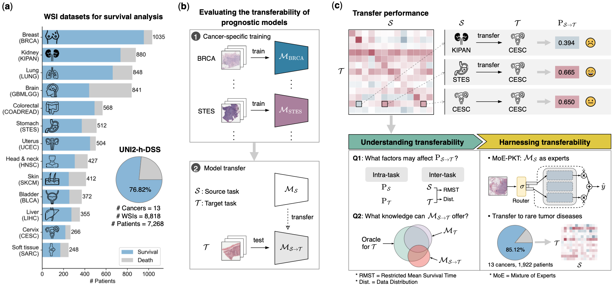

# Path-PKT: Towards Understanding and Harnessing the Transferability of Prognostic Knowledge in Computational Pathology

[[Paper]](https://arxiv.org/abs/2508.13482) | [[UNI2-h-DSS Dataset]](https://huggingface.co/datasets/yuukilp/UNI2-h-DSS) | [[Acknowledgements]](https://github.com/liupei101/Path-PKT?tab=readme-ov-file#acknowledgements) | [[Citation]](https://github.com/liupei101/Path-PKT?tab=readme-ov-file#-citation)

**Abstract**: Whole-Slide Image (WSI) is an important tool for evaluating the prognosis of cancer patients. Present WSI-based prognosis studies generally follow a conventional paradigm---cancer-specific model development---where one cancer disease corresponds to one model and this model cannot make use of the prognostic knowledge from others. Despite its notable success in recent years, this paradigm has inherent limitations and has always been struggling with practical requirements: (i) *scaling to the rare tumor diseases with very limited samples* and (ii) *benefiting from the generalizable prognostic knowledge in other cancers*. To this end, this paper presents the first systematic study on **Prognostic Knowledge Transfer in Pathology**, called **Path-PKT**. It comprises three main parts. (**1**) We curate a large dataset (UNI2-h-DSS) with 13 cancers and use it to evaluate the transferability of prognostic knowledge between different cancers computationally. (**2**) We design experiments to understand what factors affect knowledge transfer and what causes positive transfers. (**3**) Motivated by empirical findings, we propose a new baseline approach (MoE-PKT) with a routing mechanism to utilize the generalizable prognostic knowledge in other cancers. Finally, we show the transferability of source models to rare tumor diseases. This study could lay solid foundations for the study of knowledge transfer in WSI-based cancer prognosis.

<!-- Insert a pipeline of your algorithm here if got one -->
<div align="center">
    <a href="https://"></a>
</div>

---

*On updating. Stay tuned.*

📚 Recent updates:
- 25/08/19: uploaded source codes, [datasets](https://huggingface.co/datasets/yuukilp/UNI2-h-DSS), and [arXiv paper](https://arxiv.org/abs/2508.13482)
- 25/08/07: created a repo for Path-PKT

## 👩‍💻 Running Code

### Pre-requisites

All experiments are run on a machine with
- two NVIDIA GeForce RTX 3090 GPUs
- python 3.8 and pytorch==1.11.0+cu113

Detailed package requirements:
- for `pip` or `conda` users, full requirements are provided in [requirements.txt](https://github.com/liupei101/Path-PKT/blob/main/requirements.txt).
- for `Docker` users, you could use our base Docker image via `docker pull yuukilp/deepath:py38-torch1.11.0-cuda11.3-cudnn8-devel` and then install additional essential python packages (see [requirements.txt](https://github.com/liupei101/Path-PKT/blob/main/requirements.txt)) in the container.

### Training Models 

Use the following command to load a experimental configuration and then train & evaluate a survival model (based on 5-fold cross-validation):
```bash
python3 main.py --config config/cfg_sa_base_uni2h_stl_moe_pkt.yaml --handler SAT --multi_run
```

All important configurations are explained in `config/cfg_sa_base_uni2h_stl_moe_pkt.yaml`. 

For training & evaluating traditional cancer-specific survival models, use the following:
```bash
python3 main.py --config config/cfg_sa_base_uni2h_stl.yaml --handler SA --multi_run
```

## Training Logs

We advocate open-source research and would like to make our training logs publicly-available. Full training logs in this study can be accessed at [Google Drive](https://drive.google.com/drive/folders/1jWUm82pYnuIc1ova_qHqb0bFx1hjs_1G?usp=sharing).

## UNI2-h-DSS Dataset

HF Dataset (with complete DSS labels): https://huggingface.co/datasets/yuukilp/UNI2-h-DSS

## Acknowledgements

We thank the following great works that contribute to this work:

- [UNI](https://github.com/mahmoodlab/UNI): a state-of-the-art foundation model for pathology; it is used to extract patch features from WSIs.
- [UNI2-h features](https://huggingface.co/datasets/MahmoodLab/UNI2-h-features): the datasets for this study are derived from it.
- [TCGA GDC Data portal](https://portal.gdc.cancer.gov/): it provides the source data for analysis.

## 📝 Citation

If you find this work helps your research, please consider citing our paper:
```txt
@misc{liu2025pathpkt,
      title={Towards Understanding and Harnessing the Transferability of Prognostic Knowledge in Computational Pathology}, 
      author={Pei Liu and Luping Ji and Jiaxiang Gou and Xiangxiang Zeng},
      year={2025},
      eprint={2508.13482},
      archivePrefix={arXiv},
      url={https://arxiv.org/abs/2508.13482}, 
}
```